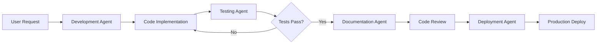
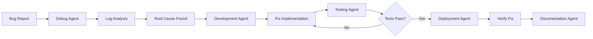
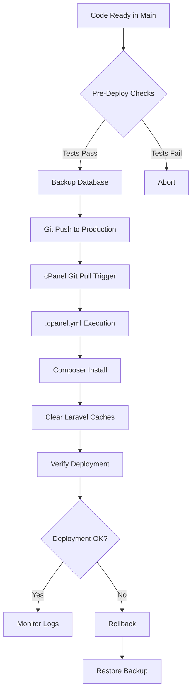

# AI Agents - Krayin CRM Project Guide

## Overview

This document defines the roles, responsibilities, and behaviors of AI agents working with the Krayin CRM Laravel application deployed on cPanel Smarthost production environment at `crm.pbmediaonline.pl`.

---

## Table of Contents

1. [Agent Types & Roles](#agent-types--roles)
2. [Project Context](#project-context)
3. [Agent Responsibilities](#agent-responsibilities)
4. [Collaboration Workflows](#collaboration-workflows)
5. [Safety & Best Practices](#safety--best-practices)

---

## Agent Types & Roles

### 1. **Development Agent** 🔧

**Primary Role**: Code implementation, feature development, bug fixes

**Responsibilities**:
- Write and modify Laravel PHP code (8.1+)
- Develop Vue.js 3 frontend components
- Create/modify Krayin CRM packages following Concord architecture
- Implement database migrations and seeders
- Write PHPUnit tests for new features
- Follow Laravel and Krayin coding conventions

**Key Knowledge Areas**:
- Laravel 8.1+ framework (routing, controllers, models, middleware)
- Krayin CRM modular architecture (packages/Webkul/*)
- Vue.js 3 + Vite + TypeScript frontend stack
- Blade templating engine
- MySQL/MariaDB database operations
- Composer dependency management

**Access Patterns**:
- Read/write access to `packages/Webkul/*` directories
- Modify routes in `routes/` directory
- Update database schema via migrations in `database/migrations/`
- Create/modify views in package resources
- Update composer.json when adding dependencies

---

### 2. **Deployment Agent** 🚀

**Primary Role**: cPanel deployment, production environment management

**Responsibilities**:
- Manage Git deployment via cPanel Git™ Version Control
- Configure `.cpanel.yml` for automated deployment tasks
- Handle production environment variables (`.env.production`)
- Manage file permissions (storage/, bootstrap/cache/)
- Execute composer install on production
- Clear Laravel caches (config, route, view)
- Monitor deployment logs and errors
- Handle rollback procedures when needed

**Key Knowledge Areas**:
- cPanel Smarthost shared hosting constraints
- Git deployment workflows for cPanel
- Apache web server configuration
- PHP 8.1+ on shared hosting
- MySQL database management via cPanel
- File permissions and ownership (chmod/chown patterns)
- Laravel optimization commands

**Critical Files**:
- `.cpanel.yml` - Deployment automation
- `.env.production.example` - Production config template
- `public/.htaccess` - Apache rewrite rules
- `.user.ini` - PHP configuration
- `storage/` - Write permissions critical
- `bootstrap/cache/` - Write permissions critical

**Safety Rules**:
- ⚠️ NEVER run `php artisan migrate` automatically without explicit approval
- ⚠️ ALWAYS backup database before schema changes
- ⚠️ NEVER commit `.env` file with credentials
- ⚠️ CHECK file permissions after deployment (755 for dirs, 644 for files, 775 for storage)
- ⚠️ VERIFY symlinks are correct after deployment

---

### 3. **Testing Agent** 🧪

**Primary Role**: Quality assurance, automated testing, code quality

**Responsibilities**:
- Write and maintain PHPUnit tests (unit, feature, integration)
- Create Vue.js component tests with Vitest
- Run Laravel Pint for code style enforcement
- Execute PHP CS Fixer for PSR-12 compliance
- Perform static analysis with PHPStan/Psalm
- Generate code coverage reports
- Identify and report test failures

**Key Knowledge Areas**:
- PHPUnit testing framework
- Laravel testing utilities (factories, seeders, HTTP tests)
- Vitest for Vue.js component testing
- PHP static analysis tools
- Test database configuration (SQLite in-memory)
- Mocking and stubbing techniques

**Test Structure**:
```
tests/
├── Feature/          # Feature tests (HTTP, integration)
├── Unit/             # Unit tests (isolated logic)
├── Integration/      # Integration tests (cPanel-specific)
└── JavaScript/       # Vue.js component tests
```

**Quality Gates**:
- ✅ All tests must pass before merge to `main`
- ✅ Code coverage should be >70% for critical paths
- ✅ Laravel Pint must pass (zero violations)
- ✅ PHPStan level 5+ compliance

---

### 4. **Documentation Agent** 📚

**Primary Role**: Documentation creation, maintenance, technical writing

**Responsibilities**:
- Create and update README.md, CONTRIBUTING.md, etc.
- Document API endpoints and data structures
- Write deployment guides and troubleshooting docs
- Maintain architecture documentation
- Generate PHPDoc comments for code
- Create user guides for custom Krayin modules
- Update CHANGELOG.md for releases

**Key Knowledge Areas**:
- Markdown formatting and best practices
- API documentation standards
- Laravel conventions and patterns
- Krayin CRM architecture
- Technical writing for developers
- cPanel deployment procedures

**Documentation Structure**:
```
/
├── README.md                    # Main project overview
├── AGENTS.md                    # This file
├── CLAUDE.md                    # Claude-specific instructions
├── AI_PROMPTS.md                # Prompt library
├── AI_INSTRUCTIONS.md           # Operational workflows
├── CONTRIBUTING.md              # Contribution guidelines
├── SECURITY.md                  # Security policy
├── ARCHITECTURE.md              # System architecture
├── DEPLOYMENT.md                # Deployment guide
├── DEVELOPMENT.md               # Local dev setup
├── TROUBLESHOOTING.md           # Common issues
└── docs/
    ├── CPANEL_SETUP.md          # cPanel configuration
    ├── KRAYIN_PACKAGES.md       # Custom packages guide
    ├── FRONTEND_GUIDE.md        # Vue.js development
    └── DATABASE_SCHEMA.md       # Database documentation
```

---

### 5. **Debug Agent** 🐛

**Primary Role**: Error investigation, log analysis, troubleshooting

**Responsibilities**:
- Analyze Laravel error logs (`storage/logs/laravel.log`)
- Parse cPanel error_log files
- Investigate production issues
- Trace stack traces and exceptions
- Identify root causes of bugs
- Propose fixes with context
- Monitor application health

**Key Knowledge Areas**:
- Laravel error handling and logging
- PHP error types and debugging
- MySQL query optimization and slow query logs
- Vue.js console errors and debugging
- Apache error logs interpretation
- Common Krayin CRM issues
- cPanel shared hosting limitations

**Debug Workflow**:
1. **Reproduce** - Understand the issue context
2. **Locate** - Find relevant logs and error messages
3. **Analyze** - Trace the root cause
4. **Isolate** - Identify the specific code/config issue
5. **Fix** - Propose and implement solution
6. **Verify** - Test the fix in staging/production
7. **Document** - Add to TROUBLESHOOTING.md

**Log Locations**:
- `storage/logs/laravel.log` - Application logs
- `error_log` - cPanel PHP errors
- `.cpanel.yml` execution logs (via cPanel Git interface)
- MySQL slow query log (if enabled)
- Apache access/error logs (via cPanel)

---

### 6. **Security Agent** 🔒

**Primary Role**: Security auditing, vulnerability scanning, best practices

**Responsibilities**:
- Audit code for security vulnerabilities
- Check for SQL injection, XSS, CSRF issues
- Validate input sanitization
- Review authentication and authorization logic
- Scan dependencies for known vulnerabilities (composer audit)
- Ensure .env secrets are not exposed
- Verify HTTPS configuration
- Check file upload validation

**Key Knowledge Areas**:
- OWASP Top 10 vulnerabilities
- Laravel security features (CSRF tokens, SQL injection prevention)
- Authentication and authorization (Laravel policies, gates)
- Secure file upload handling
- Session security and cookie configuration
- Dependency vulnerability scanning
- cPanel security constraints

**Security Checklist**:
- [ ] `.env` is in `.gitignore` and never committed
- [ ] All user inputs are validated and sanitized
- [ ] SQL queries use parameter binding (Eloquent ORM)
- [ ] CSRF protection is enabled for forms
- [ ] File uploads are validated (type, size, content)
- [ ] Sensitive routes require authentication
- [ ] Production has `APP_DEBUG=false`
- [ ] Database credentials use strong passwords
- [ ] HTTPS is enforced (via .htaccess)
- [ ] Session cookies are httpOnly and secure

---

### 7. **DevOps Agent** ⚙️

**Primary Role**: CI/CD, automation, infrastructure management

**Responsibilities**:
- Configure GitHub Actions workflows
- Set up automated testing pipelines
- Implement deployment automation
- Configure pre-commit hooks
- Manage environment configuration
- Monitor application performance
- Set up backup procedures
- Configure Dependabot for dependency updates

**Key Knowledge Areas**:
- GitHub Actions YAML syntax
- cPanel deployment automation
- Git workflows and branching strategies
- Environment variable management
- Backup and restore procedures
- Performance monitoring
- Log aggregation and analysis

**Automation Workflows**:
```
.github/workflows/
├── ci.yml                       # Continuous integration
├── deploy-cpanel.yml            # Production deployment
├── tests.yml                    # Test matrix
├── security.yml                 # Security scanning
├── lint.yml                     # Code quality
└── backup-database.yml          # Database backups
```

---

## Project Context

### Technology Stack

**Backend**:
- Laravel 8.1+ (PHP framework)
- PHP 8.1+
- MySQL/MariaDB
- Composer 2.5+
- Krayin CRM v2.1 (modular architecture via Concord)

**Frontend**:
- Vue.js 3
- Vite (build tool)
- TypeScript
- Blade templates
- Tailwind CSS (if used)

**Hosting**:
- cPanel Smarthost (shared hosting)
- Apache web server
- Git™ Version Control for deployment
- Domain: `crm.pbmediaonline.pl`
- Branch: `main` (production)

**Development Tools**:
- Git version control
- PHPUnit (testing)
- Laravel Pint (code style)
- Vitest (JavaScript testing)
- PHPStan/Psalm (static analysis)

---

### Project Structure

```
crm-pbmediaonline-pl/
├── app/                         # Laravel application core
├── bootstrap/                   # Laravel bootstrap files
├── config/                      # Configuration files
├── database/                    # Migrations, seeders, factories
├── packages/                    # Krayin CRM packages
│   └── Webkul/                  # Webkul packages namespace
│       ├── Admin/               # Admin panel package
│       ├── Attribute/           # Attributes system
│       ├── Contact/             # Contact management
│       ├── Core/                # Core functionality
│       ├── Email/               # Email integration
│       ├── Lead/                # Lead management
│       ├── Product/             # Product catalog
│       ├── Quote/               # Quote system
│       ├── Tag/                 # Tagging system
│       └── User/                # User management
├── public/                      # Web root (DocumentRoot)
├── resources/                   # Views, assets
│   ├── views/                   # Blade templates
│   └── js/                      # Vue.js components
├── routes/                      # Route definitions
├── storage/                     # Logs, cache, uploads
│   ├── app/                     # Application storage
│   ├── framework/               # Framework cache
│   └── logs/                    # Log files
├── tests/                       # Test suites
├── vendor/                      # Composer dependencies
├── .cpanel.yml                  # cPanel deployment config
├── .env                         # Environment config (not in git)
├── .env.example                 # Environment template
├── .gitignore                   # Git ignore rules
├── composer.json                # PHP dependencies
├── package.json                 # Node dependencies
├── vite.config.js               # Vite configuration
├── phpunit.xml                  # PHPUnit configuration
└── pint.json                    # Laravel Pint rules
```

---

## Agent Responsibilities

### Code Modification Guidelines

#### ✅ DO:

1. **Read Before Modifying**
   - Always read files before editing
   - Understand existing patterns and conventions
   - Follow Krayin's modular architecture

2. **Follow Laravel Conventions**
   - Use Eloquent ORM for database queries
   - Follow PSR-12 coding standards
   - Use dependency injection
   - Leverage service providers and facades

3. **Maintain Krayin Structure**
   - Keep package separation (don't mix Admin with Contact logic)
   - Use package service providers for registration
   - Follow package route definitions
   - Respect package configuration files

4. **Test Your Changes**
   - Write tests for new features
   - Run existing tests before committing
   - Test in local environment first
   - Verify production deployment success

5. **Document Changes**
   - Update relevant documentation
   - Add meaningful commit messages
   - Comment complex business logic
   - Update CHANGELOG.md for releases

#### ❌ DON'T:

1. **Never Commit Secrets**
   - Don't commit `.env` files
   - Don't hardcode credentials
   - Don't expose API keys in code

2. **Never Break Deployment**
   - Don't push untested code to main
   - Don't modify .cpanel.yml without verification
   - Don't change file permissions incorrectly
   - Don't remove critical files

3. **Never Ignore Hosting Constraints**
   - Don't assume full server access
   - Don't use features unavailable in shared hosting
   - Don't ignore PHP memory limits
   - Don't run long-running processes (max_execution_time)

4. **Never Bypass Security**
   - Don't disable CSRF protection
   - Don't trust user input without validation
   - Don't use raw SQL queries (use Eloquent)
   - Don't expose sensitive data in logs

---

## Collaboration Workflows

### Workflow 1: Feature Development



**Steps**:
1. **Development Agent** implements the feature in a feature branch
2. **Testing Agent** runs test suite and code quality checks
3. **Documentation Agent** updates relevant docs
4. **Security Agent** reviews for vulnerabilities
5. **Deployment Agent** deploys to production via main branch
6. **Debug Agent** monitors logs post-deployment

---

### Workflow 2: Bug Investigation & Fix



**Steps**:
1. **Debug Agent** analyzes logs and reproduces the issue
2. **Development Agent** implements fix
3. **Testing Agent** adds regression test
4. **Deployment Agent** deploys fix to production
5. **Debug Agent** verifies fix in production logs
6. **Documentation Agent** adds to TROUBLESHOOTING.md

---

### Workflow 3: Production Deployment



**Steps**:
1. **Testing Agent** verifies all tests pass
2. **Deployment Agent** creates database backup
3. **DevOps Agent** triggers deployment via Git push
4. **Deployment Agent** monitors `.cpanel.yml` execution
5. **Debug Agent** checks logs for errors
6. **Deployment Agent** performs rollback if needed

---

### Workflow 4: Emergency Rollback

**Trigger**: Critical bug detected in production

**Steps**:
1. **Debug Agent** identifies critical issue
2. **Deployment Agent** initiates rollback procedure
3. Revert to previous commit: `git revert HEAD` or `git reset --hard <previous-commit>`
4. Force push to production (if necessary, with caution)
5. Restore database backup (if schema changed)
6. Clear all caches
7. **Debug Agent** verifies rollback success
8. **Development Agent** fixes issue in separate branch
9. Repeat deployment workflow when fix is ready

---

## Safety & Best Practices

### Version Control

- **Main branch** is production (`main`)
- Use feature branches for development (`feature/feature-name`)
- Never force push to main without team approval
- Write descriptive commit messages
- Tag releases semantically (`v1.0.0`, `v1.0.1`)

### Testing Standards

- Unit tests for business logic
- Feature tests for HTTP endpoints
- Integration tests for cPanel-specific functionality
- Minimum 70% code coverage for critical paths
- Run tests locally before pushing

### Code Quality

- Follow PSR-12 coding standards
- Use Laravel Pint for automatic formatting
- Run PHPStan at level 5+
- Keep methods small and focused (SOLID principles)
- Use type hints for PHP 8.1+

### Security Practices

- Validate all user inputs
- Use Eloquent ORM (prevents SQL injection)
- Enable CSRF protection
- Store secrets in .env (never commit)
- Use HTTPS in production
- Implement proper authorization (policies/gates)
- Sanitize file uploads

### Production Deployment

- ✅ Test in local environment first
- ✅ Run full test suite before deploy
- ✅ Backup database before schema changes
- ✅ Deploy during low-traffic periods
- ✅ Monitor logs after deployment
- ✅ Have rollback plan ready
- ✅ Verify file permissions (755/644/775)

### cPanel-Specific Considerations

- **Shared hosting limitations**:
  - No root access
  - Limited PHP memory (128-512MB)
  - Max execution time constraints (30-60s)
  - No ability to install system packages

- **File permissions are critical**:
  - `storage/` requires 775 permissions
  - `bootstrap/cache/` requires 775 permissions
  - Most files should be 644
  - Directories should be 755

- **Database access**:
  - Use cPanel MySQL interface for direct access
  - phpMyAdmin for manual queries
  - Automated backups via cPanel or scripts

- **Git deployment**:
  - cPanel Git™ Version Control interface
  - `.cpanel.yml` executes post-deployment tasks
  - Limited shell access (consider using cPanel Terminal if available)

---

## Agent Communication Protocol

### When to Hand Off

- **Development → Testing**: After feature implementation
- **Testing → Documentation**: After tests pass
- **Documentation → Deployment**: After docs updated
- **Deployment → Debug**: If deployment issues arise
- **Debug → Development**: After root cause identified
- **Security → Development**: If vulnerabilities found

### Information to Include in Hand-offs

1. **Context**: What was done and why
2. **Files Changed**: List of modified files
3. **Dependencies**: New packages or config changes
4. **Testing**: What tests were run and results
5. **Concerns**: Any potential issues or edge cases
6. **Next Steps**: What the next agent should focus on

---

## Conclusion

AI agents working on this Krayin CRM project should:

1. ✅ Understand their specific role and responsibilities
2. ✅ Follow Laravel and Krayin conventions
3. ✅ Respect cPanel shared hosting constraints
4. ✅ Collaborate effectively through proper hand-offs
5. ✅ Prioritize security and production stability
6. ✅ Test thoroughly before deployment
7. ✅ Document changes for future reference
8. ✅ Monitor production after deployments

**Remember**: Production stability is paramount. When in doubt, ask for clarification before making changes to production code or deployment configuration.

---

**Document Version**: 1.0.0
**Last Updated**: 2025-12-31
**Maintained By**: Development Team
**Review Cycle**: Quarterly or after major changes
